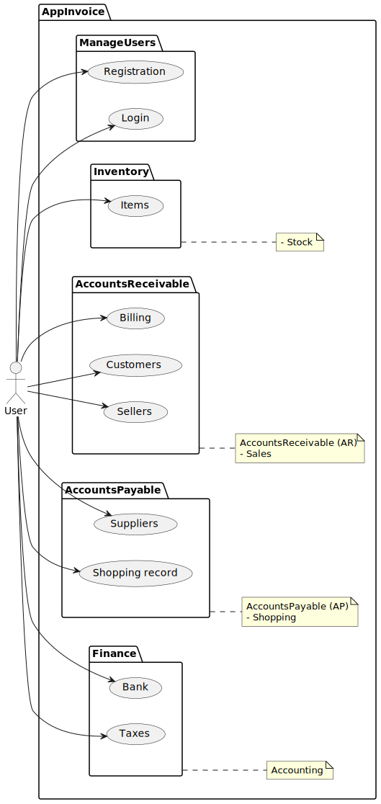
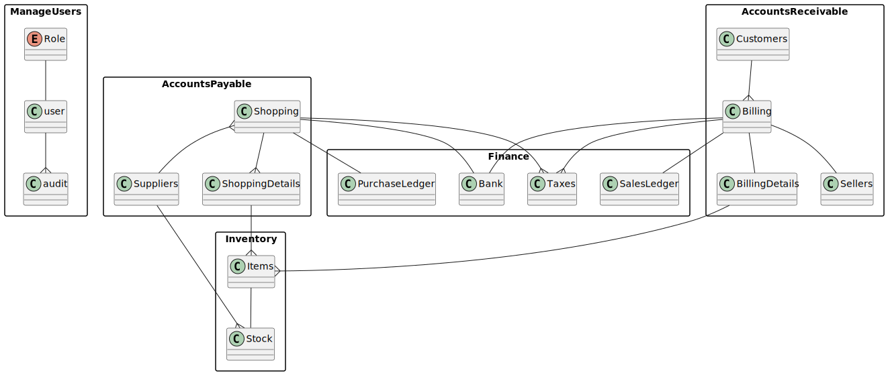

# AppInvoice

This project consists of the development of a REST service Backend application with Spring Boot that implements Spring Security for security and authentication based on JWT Tokens. It simulates a very simple administrative application with a few very basic modules and fields in each of its entities.

The system has several modules:
- An Accounts Receivable module
- An accounts payable module
- A Finance module
- An inventory module

The system was developed with Java Spring Boot, Hibernate for data persistence, JSON Web Tokens from JWT.IO, JasperReport from Jaspersoft for reports, Apache Tomcat/9.0.75, among others. 

The application is not complete with all the administrative modules that must be present in an application of this type, the application is still under construction.

# Screenshots
### Use Cases

### Entitys

